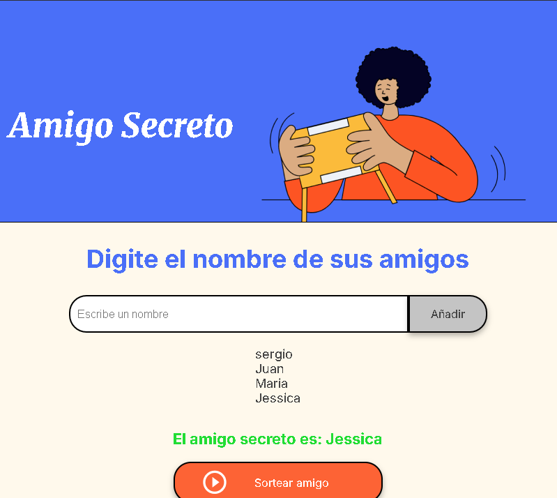

# Amigo Secreto 🎁

¡Bienvenido al proyecto **Amigo Secreto**! Esta es una aplicación web simple que permite a los usuarios agregar nombres de amigos a una lista y realizar un sorteo aleatorio para determinar quién es el "amigo secreto". Perfecto para organizar intercambios de regalos en eventos sociales.

## Características ✨

- **Agregar nombres**: Ingresa los nombres de tus amigos en un campo de texto y agrégalos a la lista.
- **Validación de entrada**: Evita nombres vacíos o duplicados.
- **Lista visible**: Visualiza todos los nombres agregados en una lista.
- **Sorteo aleatorio**: Selecciona un nombre al azar de la lista para determinar el amigo secreto.

## Tecnologías utilizadas 🛠️

- **HTML**: Estructura de la página web.
- **CSS**: Estilos y diseño responsive.
- **JavaScript**: Lógica para agregar nombres, validar entradas y realizar el sorteo.
- **Visual Studio Code**: Editor de código utilizado para desarrollar el proyecto.

## Cómo usar 🚀

1. **Clona el repositorio**:
   ```bash
   git clone https://github.com/SergioPerezD/amigosecreto_alura.git
   ```
2. **Abre el proyecto**:
   - Navega a la carpeta del proyecto:
     ```bash
     cd amigo-secreto
     ```
   - Abre el proyecto en **Visual Studio Code** o tu editor preferido.
   - Abre el archivo `index.html` en tu navegador.

3. **Agrega nombres**:
   - Escribe el nombre de un amigo en el campo de texto y haz clic en "Añadir".
   - Los nombres se mostrarán en la lista debajo del campo de entrada.

4. **Realiza el sorteo**:
   - Haz clic en el botón "Sortear amigo" para seleccionar un nombre al azar.
   - El resultado se mostrará en la pantalla.

## Capturas de pantalla 📸

  
*Interfaz principal para agregar nombres.*


  
*Sin nombres ingresados.*

  
*Nombre duplicado.*

  
*Listado de nombres.*

  
*Resultado del sorteo aleatorio.*

## Estructura del proyecto 📂

```
amigo-secreto/
├── index.html          # Archivo principal de la aplicación
├── style.css           # Estilos CSS para la interfaz
├── app.js              # Lógica de la aplicación en JavaScript
├── assets/             # Carpeta para imágenes y recursos
│   └── amigo-secreto-principal.png
│   └── amigo-secreto-sin.png
│   └── amigo-secreto-duplicado.png
│   └── amigo-secreto-listado.png
│   └── amigo-secreto-es.png
│   └── amigo-secreto.png
│   └── play_circle_outline.png
├── LICENSE             # Licencia MIT para el proyecto
├── README.md           # Este archivo
```

## Licencia 📄

Este proyecto está bajo la licencia **MIT**. Para más detalles, consulta el archivo [LICENSE](LICENSE).

---

## Contribuir 🤝

¡Las contribuciones son bienvenidas! Si deseas mejorar este proyecto, sigue estos pasos:

1. Haz un **fork** del repositorio.
2. Crea una nueva rama (`git checkout -b nueva-funcionalidad`).
3. Realiza tus cambios y haz commit (`git commit -m 'Añade nueva funcionalidad'`).
4. Haz push a la rama (`git push origin nueva-funcionalidad`).
5. Abre un **Pull Request** en GitHub.

---

## Desarrollo en Visual Studio Code 💻

Este proyecto fue desarrollado utilizando **Visual Studio Code**, un editor de código ligero pero potente. Si deseas trabajar en el proyecto, te recomendamos usar este editor. Aquí tienes algunos tips:

- **Extensiones recomendadas**:
  - **Live Server**: Para previsualizar la aplicación en tiempo real.
  - **Prettier**: Para formatear el código automáticamente.
  - **ESLint**: Para mantener un código limpio y libre de errores.

- **Cómo abrir el proyecto**:
  1. Abre Visual Studio Code.
  2. Selecciona `File > Open Folder` y elige la carpeta del proyecto.
  3. ¡Listo! Puedes comenzar a editar los archivos.

---

## Autor ✒️

- **Sergio Perez Diaz** - [https://github.com/SergioPerezD](https://github.com/SergioPerezD)

---

¡Gracias por visitar este proyecto! Esperamos que te sea útil para organizar tus intercambios de regalos. 😊
